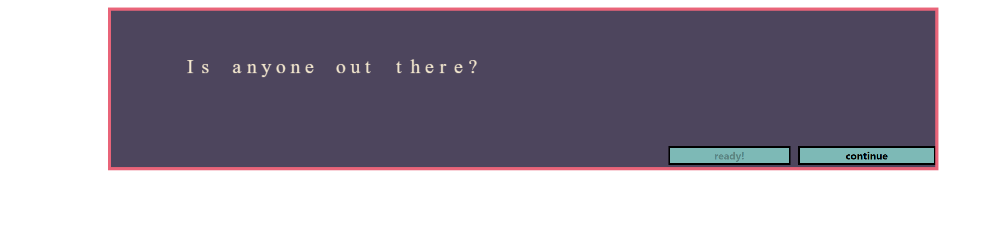
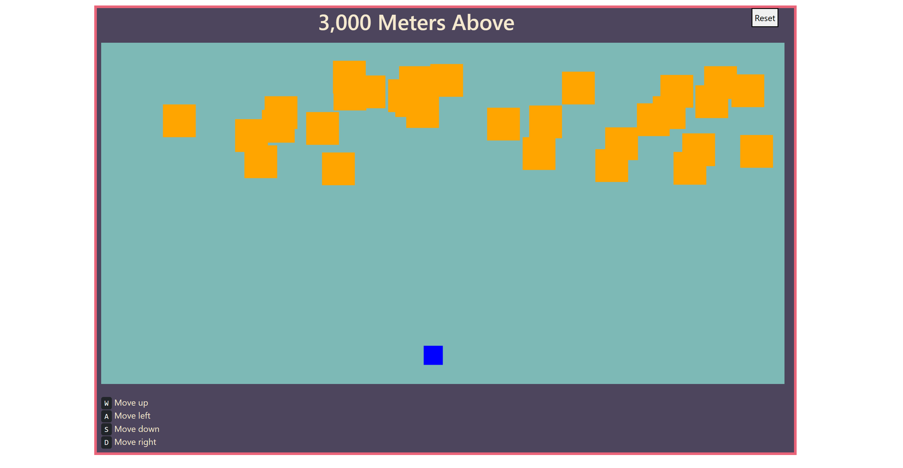

# 3,000 Meters Above 

## What
3,000 Meters Above is a short "game" that puts you into the role of a fighter pilot who needs rescuing. Advance past enemies to unlock dialogue and uncover the truth. 

## Why
To get back into web development after my 2/3 month long break. I've always wanted to make a small "game" that actually let you take control of an objects movement and knew that canvas and JavaScript could accomplish this, so this is my first crack at it.

## Site
https://marcelino-g.github.io/3-000-Meters-Above/

## Description
You are greeted with a "dialogue" page that introduces the start of the adventure. After the conversation between characters, you take control of an object with the goal of bypassing enemies and getting to the safe side. Dialogue and game play alternates until you get to the end of the story. 

"requestAnimationFrame" is key to this project because it "writes/draws" out the dialogue and player/enemy movements.

## Completed Pictures

